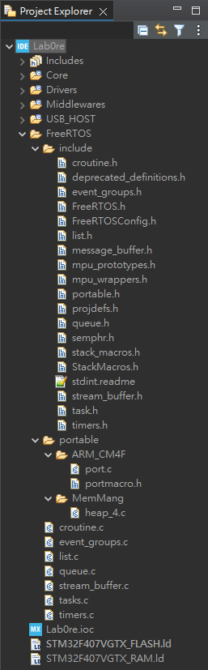

# Lab0 - Getting Started

## Prerequisite
### IDE
Download STM32CubeIDE: https://www.st.com/en/development-tools/stm32cubeide.html

### FreeRTOS
Download FreeRTOS (v10.2.1) source code: https://github.com/FreeRTOS/FreeRTOS/tree/V10.2.1

## Setup
### Create new project
1. Select a workspace in STM32CubeIDE.
2. Login
   * `Help > STM32Cube updates > Connection to myST`
3. Create project
   * `File > new > STM32 Project`
   * Select **STM32F407VG**
   * Enter the project name
   * Click Finish
### Porting FreeRTOS
1. Create a folder named `FreeRTOS` in the project root directory, and add the following subdirectories:
    ```
    FreeRTOS/
    ├─ include/
    └─ portable/
      └─ MemMang/
    ```
2. Copy the following files and directories from the downloaded FreeRTOS package to the project root:
| src                                                        |     | dst                                 |
|:---------------------------------------------------------- |:---:|:----------------------------------- |
| `FreeRTOS/Source/*.c`                                      |  →  | `[ROOT]/FreeRTOS/`                  |
| `FreeRTOS/Source/include/*`                                |  →  | `[ROOT]/FreeRTOS/include`           |
| `FreeRTOS/Demo/CORTEX_M4F_STM32F407ZG-SK/FreeRTOSConfig.h` |  →  | `[ROOT]/FreeRTOS/include/`          |
| `FreeRTOS/Source/portable/GCC/ARM_CM4F`                    |  →  | `[ROOT]/FreeRTOS/portable/`         |
| `FreeRTOS/Source/portable/MemMang/heap_4.c `               |  →  | `[ROOT]/FreeRTOS/portable/MemMang/` |

3. Refresh the project to update the file structure. 
   * The project file tree should look like:
    

4. Modify the paths and symbols

* Right-click project label, `Properties > C/C++ General > Paths and Symbols > Source Location`, click **Add Folder**, and add the `FreeRTOS` folder.

* Right-click project label, `Properties > C/C++ General > Paths and Symbols > Includes`, click **Add** then **File System...**, and add `include` & `ARM_CM4F` in the FreeRTOS directory.

## Modify `[ROOT]/FreeRTOS/include/FreeRTOSConfig.h`

Modify `#ifdef__ICCARM__` into `#if defined(__ICCARM__) || defined(__CC_ARM) || defined(__GNUC__)` or `#ifdef__GNUC__`.

```diff=44
/* Ensure stdint is only used by the compiler, and not the assembler. */
-#ifdef __ICCARM__
+#if defined(__ICCARM__) || defined(__CC_ARM) || defined(__GNUC__)
	#include <stdint.h>
	extern uint32_t SystemCoreClock;
#endif
```


Change all the following config to 0, otherwise related HOOK functions need to be implemented.
```diff=50
#define configUSE_PREEMPTION			1
+ #define configUSE_IDLE_HOOK				0
+ #define configUSE_TICK_HOOK				0
#define configCPU_CLOCK_HZ				( SystemCoreClock )
#define configTICK_RATE_HZ				( ( TickType_t ) 1000 )
#define configMAX_PRIORITIES			( 5 )
#define configMINIMAL_STACK_SIZE		( ( unsigned short ) 130 )
#define configTOTAL_HEAP_SIZE			( ( size_t ) ( 75 * 1024 ) )
#define configMAX_TASK_NAME_LEN			( 10 )
#define configUSE_TRACE_FACILITY		1
#define configUSE_16_BIT_TICKS			0
#define configIDLE_SHOULD_YIELD			1
#define configUSE_MUTEXES				1
#define configQUEUE_REGISTRY_SIZE		8
+ #define configCHECK_FOR_STACK_OVERFLOW	0
#define configUSE_RECURSIVE_MUTEXES		1
+ #define configUSE_MALLOC_FAILED_HOOK	0
#define configUSE_APPLICATION_TASK_TAG	0
#define configUSE_COUNTING_SEMAPHORES	1
#define configGENERATE_RUN_TIME_STATS	0
```
## Basic Timer

## NVIC

## Comment handler
Every time the code is generated or the `.ioc` file is saved (when the "Do you want to generate code?" window pops up), these 3 handlers are overwritten and need to be commented out again.

## Build
Replace `main.c` with a sample file `Lab0/main.c`. The board's green LED should start blinking.
